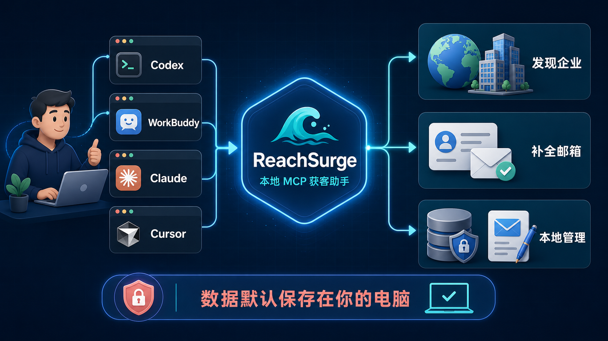
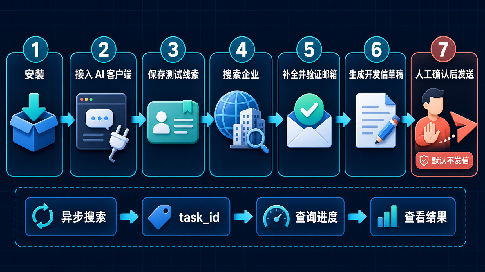

# ReachSurge

一个运行在你自己电脑上的 B2B 获客 MCP Server：让 AI 客户端通过标准 MCP 工具搜索海外企业线索、补全和验证公开邮箱、保存本地线索，并在你主动开启后连接自己的邮箱。

> 当前版本是 Alpha。本项目实现的是**本地 stdio MCP**，适用于能启动本地命令的 MCP 客户端；它不是公网 SaaS，也没有提供远程 HTTP 接口。

## 一张图看懂 ReachSurge



ReachSurge 不是一个新的聊天软件，也不替代 Codex、WorkBuddy、Claude 或 Cursor。它是在你的电脑上运行的一组 MCP 工具：AI 客户端负责理解你的要求，ReachSurge 负责搜索、整理和保存线索，数据默认留在本机。

## 先看兼容范围

ReachSurge 不绑定 Claude，也不绑定某个大模型。它使用标准 MCP stdio 传输，客户端只要允许配置下面三项，就可以接入：

- Transport：`stdio`
- Command：ReachSurge 虚拟环境里的可执行文件
- Environment：可选的 `.env` 和数据目录路径

| 客户端 | 当前结论 | 接入方式 |
|---|---|---|
| Codex CLI / Codex 桌面端 | 支持本地 stdio MCP | 本页有已核验命令 |
| Claude Code / Claude Desktop | 支持本地 stdio MCP | 命令或通用 JSON 配置 |
| Cursor | 支持本地 stdio MCP | 通用 JSON 配置 |
| WorkBuddy | 官方支持本地 command 型 MCP | 通用 JSON 配置 |
| 自建 MCP Agent | 支持 stdio 即可 | 使用通用配置字段 |
| 豆包消费端 | 未找到“任意本地 stdio MCP”的可靠官方入口 | **暂不宣称直接兼容** |
| 只接受远程 URL 的云端 Agent | 不能启动本地进程 | 当前版本不能直接连接 |

“支持 MCP”不一定等于“支持本地 stdio”。如果某个平台只让你填一个 `https://...` 地址，当前版本不能直接使用。不要为了兼容它而把本服务无认证暴露到公网。

## 它能做什么

- 从 OpenStreetMap、SerpApi、Hunter、Tavily、Europages、ImportYeti 等来源发现企业线索；没有对应 Key 时自动跳过该来源。
- 将不同来源归一化、去重、评分并保存到本地 SQLite。
- 从企业官网公开页面、Hunter 和 SMTP 探测中补全或验证邮箱。
- 维护本地产品资料、线索状态、公司画像和异步任务。
- 生成开发信所需的上下文提示，由宿主 AI 写成草稿。
- 在本机所有者明确开启并逐次确认后，通过 SMTP 真发信、通过 IMAP 读取收件箱。

## 使用逻辑



小白只需要记住这条主线：

1. **安装并接入 AI 客户端**：先让 Codex、WorkBuddy、Claude 或 Cursor 能看到 ReachSurge 的工具。
2. **保存一条测试线索**：不填 API Key、不访问付费服务，先确认本地 MCP 和数据库工作正常。
3. **按需开启搜索源**：在 `.env` 中填写你已有的 Key；没有 Key 的来源会自动跳过。
4. **让 AI 搜索企业**：长时间搜索会立即返回 `task_id`，AI 再通过 `get_task_status` 查询进度和结果。
5. **补全、验证并管理线索**：公开邮箱、企业信息和状态统一保存在你的本地数据目录。
6. **生成开发信草稿**：ReachSurge 提供公司和产品上下文，由宿主 AI 写成草稿，不会自动发送。
7. **人工确认后才发送**：真发信默认关闭；只有本机开启开关，并且每次明确确认后，`send_email` 才会执行。

## 零 Key 快速开始

第一次安装不需要申请任何 API Key。先证明 MCP 能启动、客户端能看到工具，再逐项开启搜索源。

### 1. 准备环境

- Python 3.10 或更高版本
- Git
- 一个支持本地 stdio MCP 的客户端

先检查 Python 版本：

```bash
python3 --version
```

Windows 可使用：

```powershell
py -3.11 --version
```

如果版本低于 3.10，请先安装新版 Python。不要依赖裸 `python`：很多 Mac 没有这个命令，GUI 客户端也不一定继承终端 PATH。

### 2. 安装 ReachSurge

macOS / Linux：

```bash
git clone https://github.com/erduo1998-cell/reachsurge.git
cd reachsurge
python3 -m venv .venv
./.venv/bin/python -m pip install --upgrade pip
./.venv/bin/python -m pip install -e .
cp .env.example .env
chmod 600 .env
./.venv/bin/python -c "from mcp_server import TOOLS; print(f'ReachSurge OK: {len(TOOLS)} tools')"
```

Windows PowerShell：

```powershell
git clone https://github.com/erduo1998-cell/reachsurge.git
cd reachsurge
py -3.11 -m venv .venv
.\.venv\Scripts\python.exe -m pip install --upgrade pip
.\.venv\Scripts\python.exe -m pip install -e .
copy .env.example .env
.\.venv\Scripts\python.exe -c "from mcp_server import TOOLS; print(f'ReachSurge OK: {len(TOOLS)} tools')"
```

看到 `ReachSurge OK: 20 tools` 说明代码和依赖已正常安装。

### 3. 接到你的 AI 客户端

先取得启动程序的绝对路径。

macOS / Linux：

```bash
cd /你的绝对路径/reachsurge
pwd
```

启动程序通常是：

```text
/你的绝对路径/reachsurge/.venv/bin/reachsurge-mcp
```

Windows 通常是：

```text
C:\你的绝对路径\reachsurge\.venv\Scripts\reachsurge-mcp.exe
```

#### Codex

```bash
codex mcp add reachsurge \
  --env LEADGEN_ENV_FILE=/你的绝对路径/reachsurge/.env \
  --env LEADGEN_DATA_DIR=/你的绝对路径/reachsurge-data \
  --env REACHSURGE_USER_ID=default \
  -- /你的绝对路径/reachsurge/.venv/bin/reachsurge-mcp
```

检查是否成功：

```bash
codex mcp list
```

也可以在 `~/.codex/config.toml` 中写：

```toml
[mcp_servers.reachsurge]
command = "/你的绝对路径/reachsurge/.venv/bin/reachsurge-mcp"
startup_timeout_sec = 20
tool_timeout_sec = 360

[mcp_servers.reachsurge.env]
LEADGEN_ENV_FILE = "/你的绝对路径/reachsurge/.env"
LEADGEN_DATA_DIR = "/你的绝对路径/reachsurge-data"
REACHSURGE_USER_ID = "default"
```

`search_leads` 和邮箱富集已经使用异步任务，通常不会占满客户端超时；较慢的单独抓取工具仍建议保留较长的 `tool_timeout_sec`。

#### WorkBuddy、Claude Desktop、Cursor 及其他 JSON 客户端

在客户端的 MCP 设置中加入：

```json
{
  "mcpServers": {
    "reachsurge": {
      "command": "/你的绝对路径/reachsurge/.venv/bin/reachsurge-mcp",
      "env": {
        "LEADGEN_ENV_FILE": "/你的绝对路径/reachsurge/.env",
        "LEADGEN_DATA_DIR": "/你的绝对路径/reachsurge-data",
        "REACHSURGE_USER_ID": "default"
      }
    }
  }
}
```

Windows JSON 中推荐使用 `/`，例如：

```json
{
  "mcpServers": {
    "reachsurge": {
      "command": "C:/Users/你的用户名/reachsurge/.venv/Scripts/reachsurge-mcp.exe",
      "env": {
        "LEADGEN_ENV_FILE": "C:/Users/你的用户名/reachsurge/.env",
        "LEADGEN_DATA_DIR": "C:/Users/你的用户名/reachsurge-data",
        "REACHSURGE_USER_ID": "default"
      }
    }
  }
}
```

WorkBuddy 可在「插件 → MCP 服务器 → 配置 MCP」粘贴；Claude Desktop 和 Cursor 在各自 MCP 设置中使用相同的 `command` / `env` 结构。保存后请完全退出并重启客户端。

### 4. 做第一次安全测试

在客户端中发送：

> 用 ReachSurge 保存一条测试线索，公司名是 ReachSurge Test，国家是 Germany，然后列出刚保存的线索。不要发送邮件。

这条测试只写本地数据库，不调用付费 API，也不会发邮件。

## 开启真实搜索

编辑项目根目录的 `.env`。所有 Key 都是可选的，留空就不会启用对应来源。

```dotenv
DEEPSEEK_API_KEY=
SERPAPI_API_KEYS=
HUNTER_API_KEY=
TAVILY_API_KEYS=
```

| 配置 | 开启能力 | 不配置时 |
|---|---|---|
| 无 Key | 本地 CRM、知识库、OSM 公共端点、部分公开网页能力 | 仍可启动和使用本地功能 |
| `DEEPSEEK_API_KEY` | 产品词提取、公司画像、线索 LLM 过滤 | 跳过 LLM 过滤或返回降级结果 |
| `SERPAPI_API_KEYS` | Google Maps 企业搜索 | 跳过 SerpApi |
| `HUNTER_API_KEY` | Hunter Discover 和邮箱富集 | 跳过 Hunter |
| `TAVILY_API_KEYS` | 展会和网页搜索 | 跳过 Tavily |
| `CAPSOLVER_API_KEY` | Europages WAF 处理 | Europages 不可用 |

Key 的申请方式、价格和额度会变化，请以各服务商官网为准。本项目不会替你申请、托管或转售 Key。

配置后可以说：

> 用 ReachSurge 搜德国 LED lighting 经销商，最多 10 条。搜索是异步任务，拿到 task_id 后继续帮我查询进度，完成后列出结果。

`search_leads` 会先返回 `task_id`，客户端应随后调用 `get_task_status`。这样即使多个数据源较慢，也不会让一次 MCP 请求长时间卡住。

## 可选浏览器能力

Europages 和 ImportYeti 依赖 Playwright + Chromium，不影响主流程。需要时再安装：

macOS / Linux：

```bash
./.venv/bin/python -m pip install -e ".[browser]"
./.venv/bin/playwright install chromium
```

Windows：

```powershell
.\.venv\Scripts\python.exe -m pip install -e ".[browser]"
.\.venv\Scripts\playwright.exe install chromium
```

`gosom` Google Maps 源还需要独立的 `google_maps_scraper` 二进制。将路径写入 `.env`：

```dotenv
GOSOM_BIN=/绝对路径/google_maps_scraper
```

不安装时该来源会降级，其他来源不受影响。

## 真发邮件：默认关闭

`compose_outreach` 只提供写信上下文，由宿主 AI 生成草稿，不会发送。

`send_email` 是真实外部动作，代码设置了三道门：

1. 本机 `.env` 必须显式设置 `REACHSURGE_ENABLE_SEND_EMAIL=1`；
2. 每一次工具调用都必须包含 `confirm_send=true`；
3. 达到本机 `.env` 的 `REACHSURGE_DAILY_SEND_LIMIT` 硬上限后服务端拒绝继续发送；模型不能调高该上限。

邮件凭证只从 `.env` 读取，MCP 工具不能修改 SMTP/IMAP 地址、用户名或密码。请使用邮箱服务商提供的**应用专用密码**，不要使用邮箱登录密码。

```dotenv
REACHSURGE_ENABLE_SEND_EMAIL=0
REACHSURGE_DAILY_SEND_LIMIT=30
REACHSURGE_SMTP_HOST=
REACHSURGE_SMTP_PORT=587
REACHSURGE_SMTP_USER=
REACHSURGE_SMTP_PASSWORD=
REACHSURGE_ENABLE_CHECK_INBOX=0
REACHSURGE_IMAP_HOST=
REACHSURGE_IMAP_PORT=993
REACHSURGE_IMAP_USER=
REACHSURGE_IMAP_PASSWORD=
REACHSURGE_MAX_EMAIL_BYTES=5242880
```

只有确认测试收件人、主题和正文后，才把开关改为 `1` 并重启客户端。AI 仍可能错误判断，因此真实发送前应让 MCP 客户端向人类展示确认界面。

收件箱包含私人内容，`check_inbox` 也默认关闭；只有确实要让当前 MCP 客户端读取邮箱时，才设置 `REACHSURGE_ENABLE_CHECK_INBOX=1`。启用后会把发件人、主题和最多 2000 个字符的纯文本正文摘录明文写入本地数据库；整封邮件超过 `REACHSURGE_MAX_EMAIL_BYTES`（默认 5 MiB）时会在下载正文前跳过。

## 安全与隐私边界

### 已做的保护

- Git 当前历史和不可达 Git 对象已经扫描，未发现真实 API Key、SMTP/IMAP 密码、私钥或证书。
- 工具调用日志只记录工具名和参数名，不记录参数值、邮件正文、Key 或密码。
- SMTP/IMAP 密码只从服务端 `.env` 读取，不经过模型工具参数。
- SMTP/IMAP 使用系统信任库校验证书，不接受未验证 TLS。
- 网站抓取和邮件连接默认阻止 localhost、私网、链路本地和云元数据地址；重定向目标会重新检查。
- SQLite、知识库、Fernet Key 和代理池尽可能使用当前用户专属文件权限。
- 号池 API Key 和代理 URL 落库前使用 Fernet 加密，状态输出会遮罩凭证。
- `user_id` 默认由服务端固定为 `REACHSURGE_USER_ID`，模型不能切换到其他命名空间。

### 仍然必须理解的限制

- `.env` 是本机明文文件；Fernet 只保护数据库字段，不保护 `.env`，也不能抵御本机账号已失陷。
- 自动生成的 Fernet Key 与数据在同一台电脑上，能降低“只拿到数据库文件”的风险，不等于硬件级密钥隔离。
- `user_id` 是本地数据命名空间，不是登录认证。高级开关 `REACHSURGE_ALLOW_USER_NAMESPACES=1` 也不会把它变成安全多租户。
- 当前没有远程 HTTP、OAuth、TLS 网关或租户授权，绝不能直接监听公网。
- SerpApi、Hunter、Tavily、DeepSeek、SMTP/IMAP 等第三方会收到完成对应功能所需的查询词、域名、邮箱或邮件内容。
- 网站抓取仍受 DNS rebinding 等复杂网络攻击面的影响；默认私网拦截降低风险，但不能替代操作系统网络隔离。
- 后台任务运行在 MCP 本地进程中。客户端退出会终止任务；请保持客户端运行，并在重启后重新发起中断任务。
- 冷邮件、网站抓取、社交平台数据和 SMTP 探测可能受服务条款、反滥用规则及当地隐私/营销法律约束，使用者负责合规。

完整披露与报告方式见 [SECURITY.md](SECURITY.md)。

## 数据放在哪里

推荐在 MCP 配置中显式设置：

```text
LEADGEN_DATA_DIR=/一个只有你能访问的绝对路径/reachsurge-data
```

目录结构：

```text
reachsurge-data/
├── leadgen_fernet.key
├── sqlite/
│   ├── user_default.db
│   └── keypool.db
└── knowledge/
    └── default/
```

不设置时会使用操作系统标准的用户数据目录，而不是写进 Python 安装目录：

- macOS：`~/Library/Application Support/ReachSurge`
- Linux：`~/.local/share/ReachSurge`
- Windows：当前用户的 Local App Data 目录

旧版本若已经把数据库直接放在 `LEADGEN_DATA_DIR` 根目录，代码会检测并继续使用旧布局，避免升级后看不到原数据。

## 20 个工具

| 类别 | 工具 | 行为与风险 |
|---|---|---|
| 配置 | `save_user_config` | 保存产品、市场和每日限额；不能写邮件凭证 |
| 配置 | `get_user_config` | 读取当前本地配置，不回显密码 |
| 知识库 | `add_knowledge` | 写本地产品资料 |
| 知识库 | `search_knowledge` | 读本地知识库 |
| 线索 | `save_lead` | 写一条本地线索 |
| 线索 | `list_leads` | 读取本地线索 |
| 线索 | `update_lead_status` | 更新本地线索状态 |
| 发现 | `search_leads` | 首选异步入口；访问外网、可能消耗第三方额度、写本地库 |
| 发现 | `search_customers` | 旧的同步多源入口，可能较慢 |
| 发现 | `osm_overpass_search` | 访问 OSM 公共端点并写本地库 |
| 发现 | `importyeti_lookup` | 浏览器查询美国海关公开数据 |
| 发现 | `social_profile_lookup` | 抓取 TikTok/Instagram 公开资料 |
| 情报 | `enrich_company_profile` | 抓企业官网、可调用 DeepSeek、写画像 |
| 邮箱 | `verify_email` | DNS + SMTP RCPT 探测，不发送正文邮件 |
| 邮箱 | `enrich_lead_emails` | 异步抓官网/Hunter/SMTP，写本地线索 |
| 邮箱 | `compose_outreach` | 返回写信上下文，宿主 AI 生成草稿，不发送 |
| 邮箱 | `send_email` | **真实发送，默认关闭，需逐次确认** |
| 邮箱 | `check_inbox` | 读取 IMAP，将发件人、主题和正文摘录写入本地库 |
| 任务 | `get_task_status` | 查询异步搜索或邮箱富集任务 |
| 运维 | `keypool_status` | 返回脱敏后的号池、配额和代理状态 |

工具的参数 schema 以 `mcp_server.py` 中的 `TOOLS` 为真源。服务端会再次校验枚举、长度、数值范围和额外字段，不依赖客户端是否主动校验。

## 常见问题

### `python: command not found`

不要使用系统裸 `python`。安装时用 `python3` 或 Windows 的 `py -3.11`；客户端 command 必须指向 `.venv` 里的 `reachsurge-mcp` 绝对路径。

### `ModuleNotFoundError: mcp`

客户端启动了错误的 Python。重新执行 `pip install -e .`，并检查配置指向当前仓库 `.venv`。

### 手工运行后终端一直空白

这是正常现象。stdio MCP Server 在等待客户端从 stdin 发协议消息。不要在普通终端里把“没有输出”当成死机。

### 客户端显示连接失败

依次检查：

1. command 是否为绝对路径；
2. `.venv` 中的启动文件是否存在；
3. Python 是否为 3.10+；
4. JSON 斜杠和引号是否正确；
5. 修改配置后是否完全退出并重启客户端；
6. 客户端是否真的支持**本地 stdio**，而不只是远程 MCP URL。

### 搜索返回 0 条

先用“保存一条测试线索再列出”的本地测试确认 MCP 已连接。0 条也可能是数据源超时、Key 未配置、Key 失效、第三方限流、搜索词过窄或网络不可达，不等于安装失败。

### `.env` 没生效

项目根 `.env` 会自动加载。GUI 客户端工作目录不确定时，在 MCP env 中显式设置 `LEADGEN_ENV_FILE` 的绝对路径。

### Playwright 已安装但浏览器工具报错

还需要执行 `playwright install chromium`。浏览器能力是可选项，没装不会影响本地 CRM、OSM 和其他非浏览器来源。

### 邮件认证失败

使用邮箱服务商的应用专用密码，检查 SMTP/IMAP 是否已开启。不要关闭 TLS 证书校验。私有邮件服务器需要内网访问时，只有明确理解风险后才设置 `REACHSURGE_ALLOW_PRIVATE_NETWORK=1`。

## 开发与验证

```bash
./.venv/bin/python -m pip install -e ".[test]"
./.venv/bin/python -m pytest -q
./.venv/bin/python -m compileall -q .
```

自动测试覆盖工具 schema、无 Key 启动、真实 stdio initialize/tools/list、本地命名空间、凭证脱敏、私网地址拦截、邮件功能开关和 TLS 配置；CI 还会在三种操作系统和两个 Python 版本上重新安装验证。

## 项目结构

```text
reachsurge/
├── mcp_server.py          # MCP 工具 schema、路由与 stdio 入口
├── security.py            # 参数、脱敏、命名空间与外连安全检查
├── registry.py            # 多源归一化、去重和排序
├── keypool.py             # 加密 Key/代理池与配额
├── sources/               # 数据源和邮箱富集适配器
├── storage/               # SQLite 与本地知识库
├── tools/                 # 邮箱验证等工具
├── tests/                 # 自动化验收
└── .env.example           # 空值安全模板
```

## 联系作者

使用中遇到问题、有功能建议或希望交流合作，可以扫码添加作者微信。添加时请备注 **ReachSurge**，方便识别来意。

<p align="center">
  
</p>

## License

[MIT](LICENSE)
